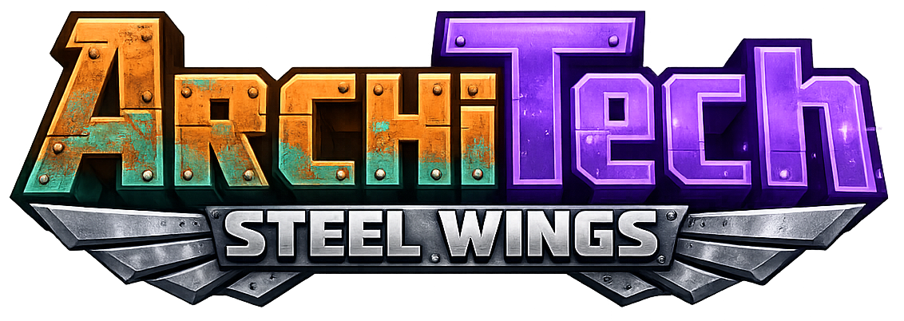

<p align="center">
  
</p>

<h1 align="center">ArchiTech Launcher</h1>

<p align="center">
  <strong>A dedicated Minecraft launcher for the ArchiTech server.</strong><br>
  Authentication, client installation, updates, mod synchronization, server status, and game launch in one desktop application.
</p>

<p align="center">
  
  
  
  
  <a href="https://github.com/Reijin2312/ArchiTech_Launcher/issues"></a>
  <a href="https://github.com/Reijin2312/ArchiTech_Launcher/stargazers"></a>
</p>

<p align="center">
  <a href="https://architech-mc.ru/">Website</a>
  ·
  <a href="https://t.me/archi_tech_official">Telegram</a>
  ·
  <a href="https://github.com/Reijin2312/ArchiTech_Launcher/issues">Issues</a>
  ·
  <a href="https://github.com/Reijin2312/ArchiTech_Launcher/releases">Releases</a>
</p>

---

## About

**ArchiTech Launcher** is a JavaFX-based Minecraft launcher built specifically for the ArchiTech server ecosystem.

It prepares a complete Minecraft 1.21.1 + NeoForge installation, authenticates players through the ArchiTech backend, downloads and verifies required game files, synchronizes the managed modpack, writes the server entry, and starts the client with the correct account and launch arguments.

> [!IMPORTANT]
> This is a server-specific launcher, not a general-purpose replacement for the official Minecraft Launcher.
> It depends on ArchiTech web services, authentication endpoints, file manifests, and server configuration.

## Features

* Browser-based sign-in and registration through the ArchiTech account system
* Secure local account and token storage
* Automatic access-token refresh and profile updates
* Minecraft 1.21.1 client, libraries, assets, and native dependency installation
* Automatic NeoForge installation and validation
* Manifest-based mod downloading, updating, disabling, and cleanup
* Parallel downloads with retries, cancellation, progress reporting, and timeouts
* File size, SHA-1, and SHA-256 integrity verification
* Temporary downloads and atomic replacement of completed files
* Protected path handling and safe native archive extraction
* Live server status, online player count, ping, and player list
* News panel and configurable launcher backgrounds
* Configurable game directory, Java executable, language, network timeout, and launch behavior
* Automatic `servers.dat` generation for the ArchiTech server
* Discord Rich Presence integration
* Game-process locking to prevent duplicate client launches

## Requirements

### Running the launcher

* A valid ArchiTech account
* Internet access to the ArchiTech frontend, backend, file services, and Minecraft services
* A Java 21 runtime when launching the development JAR directly

### Building from source

* **JDK 21**
* **Git**
* No system-wide Gradle installation is required; the repository includes the Gradle Wrapper

## Getting started

### Clone the repository

```bash
git clone https://github.com/Reijin2312/ArchiTech_Launcher.git
cd ArchiTech_Launcher
```

### Run in development mode

Windows:

```powershell
.\gradlew.bat run
```

Linux or macOS:

```bash
./gradlew run
```

### Run the test suite

Windows:

```powershell
.\gradlew.bat test
```

Linux or macOS:

```bash
./gradlew test
```

The HTML test report is generated at:

```text
build/reports/tests/test/index.html
```

### Build the launcher JAR

Windows:

```powershell
.\gradlew.bat clean shadowJar
```

Linux or macOS:

```bash
./gradlew clean shadowJar
```

The resulting fat JAR is written to:

```text
build/libs/*-all.jar
```

> [!NOTE]
> JavaFX packaging can be platform-specific. Build and test release artifacts on every operating system you intend to support.

## Configuration

On first launch, the application creates `launcher_config.json` next to the launcher installation.

Example configuration:

```json
{
  "gameDir": "C:\\Users\\Player\\.architech",
  "javaPath": "C:\\Program Files\\Java\\jdk-21\\bin\\javaw.exe",
  "closeOnLaunch": false,
  "netTimeout": 30000,
  "autoUpdate": true,
  "language": "ru-RU",
  "background": "CherryAndRiver.png"
}
```

| Property        | Description                                                |
| --------------- | ---------------------------------------------------------- |
| `gameDir`       | Directory containing the managed Minecraft installation    |
| `javaPath`      | Java executable used to start Minecraft                    |
| `closeOnLaunch` | Close the launcher after the game starts                   |
| `netTimeout`    | Network timeout in milliseconds                            |
| `autoUpdate`    | Automatically verify and update client files before launch |
| `language`      | Minecraft language tag, such as `ru-RU` or `en-US`         |
| `background`    | File name of the selected launcher background              |

Most of these options can also be changed from the launcher settings screen.

## Project structure

```text
src/
├── main/
│   ├── java/org/architech/launcher/
│   │   ├── authentication/   Account, browser auth, tokens, and join tickets
│   │   ├── discord/          Discord Rich Presence integration
│   │   ├── gui/              JavaFX interface, settings, news, and player UI
│   │   ├── managment/        Downloads, versions, NeoForge, natives, and mods
│   │   └── utils/            JSON, logging, paths, ZIP safety, and server data
│   └── resources/            CSS themes, images, icons, and application assets
└── test/
    └── java/                  Unit and integration tests
```

## Launch flow

At a high level, the launcher performs the following operations:

1. Loads launcher configuration and the saved account.
2. Refreshes authentication tokens and the player profile when necessary.
3. Resolves the required Minecraft version metadata.
4. Downloads and verifies the client, libraries, assets, and native files.
5. Installs or validates NeoForge.
6. Synchronizes files controlled by the ArchiTech mod manifest.
7. Writes the ArchiTech entry to `servers.dat`.
8. Requests a server join ticket.
9. Builds the Minecraft classpath and launch arguments.
10. Starts and tracks the Minecraft process.

## Download and file safety

The download pipeline is designed to avoid leaving corrupted installations behind:

* Files are downloaded to temporary `.part` files.
* HTTP responses are validated before their bodies are accepted.
* Expected sizes and cryptographic hashes are verified before installation.
* Existing valid files are not replaced by failed downloads.
* Completed files are moved into place atomically where supported.
* Manifest paths are validated before resolving them inside the game directory.
* Native archives are extracted with path traversal and archive-size protections.

## Tests

The test suite covers the most failure-prone parts of the launcher, including:

* Concurrent and retried HTTP downloads
* Invalid hashes and unsuccessful HTTP responses
* Preservation of an existing file after a failed update
* Manifest path validation and traversal attempts
* Safe native ZIP extraction and Zip Slip prevention
* Native directory preparation
* Mod manifest synchronization and disabled-file state

Run all tests before submitting changes:

```bash
./gradlew test
```

## Adapting the launcher for another server

The launcher is currently tied to the ArchiTech infrastructure through constants and backend contracts in the application code.

A fork intended for another server will need to replace or redesign at least:

* Frontend and backend URLs
* Minecraft server address
* Authentication and token-refresh endpoints
* Account/profile response models
* News and server-status integrations
* File and mod manifest endpoints
* Join-ticket handling
* Branding, images, CSS, and default configuration

Changing only the visible server name is not sufficient.

## Contributing

Bug reports and focused pull requests are welcome.

1. Fork the repository.
2. Create a branch for the change.
3. Keep unrelated refactoring out of bug-fix pull requests.
4. Add or update tests for behavioral changes.
5. Run the full test suite.
6. Open a pull request with a clear description of the problem and solution.

```bash
git checkout -b fix/short-description
./gradlew test
```

Please report security-sensitive issues privately instead of publishing working exploits in a public issue.

## Support

* Website: [architech-mc.ru](https://architech-mc.ru/)
* Community and announcements: [ArchiTech Telegram](https://t.me/archi_tech_official)
* Bugs and feature requests: [GitHub Issues](https://github.com/Reijin2312/ArchiTech_Launcher/issues)

## License

ArchiTech Launcher source code, tests, documentation, and build scripts are
licensed under the GNU General Public License version 3 only
(`GPL-3.0-only`), except where a file states otherwise.

See the full license text in [LICENSE](LICENSE).

The ArchiTech name, logo, application icon, visual identity, and official
branding are not licensed for use as the branding of derivative projects.
Forks must use a distinct name and branding and must not imply official status
or endorsement.

See:

- [TRADEMARKS.md](TRADEMARKS.md)
- [ASSET_LICENSE.md](ASSET_LICENSE.md)
- [THIRD_PARTY_NOTICES.md](THIRD_PARTY_NOTICES.md)

Third-party libraries, downloaded game components, and third-party assets remain
subject to their respective licenses and terms.

This software is provided without warranty, to the extent permitted by law.

---

<p align="center">
  Built for the <strong>ArchiTech</strong> Minecraft community.
</p>
